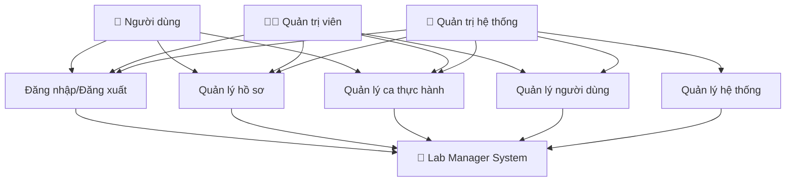
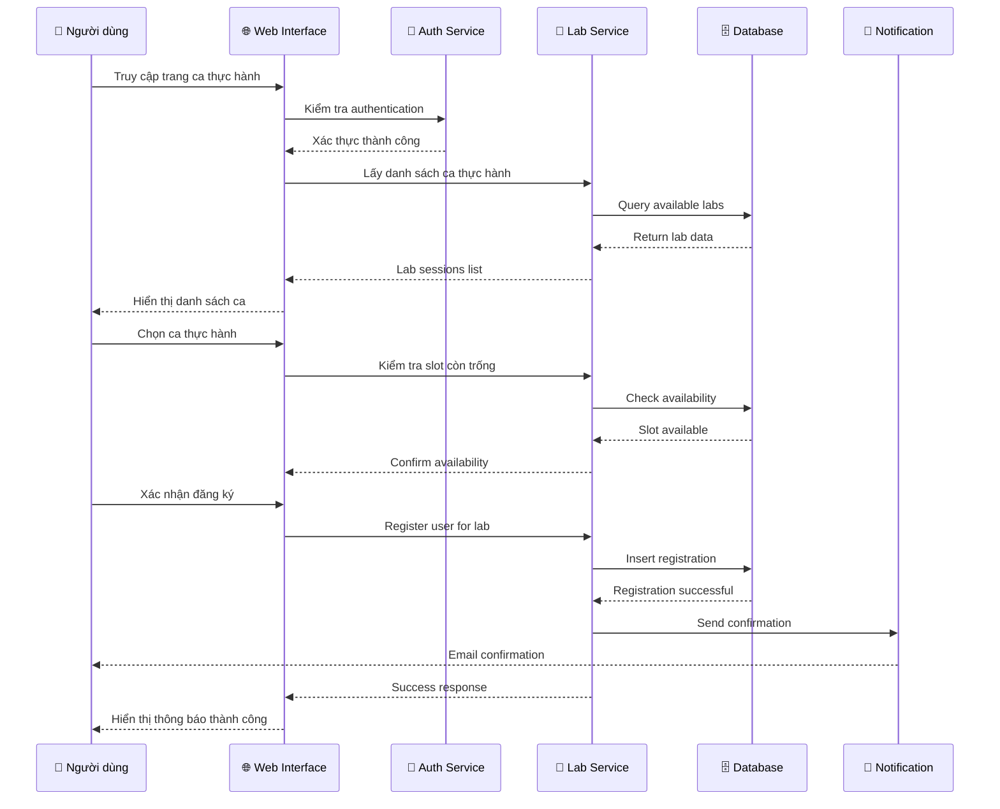
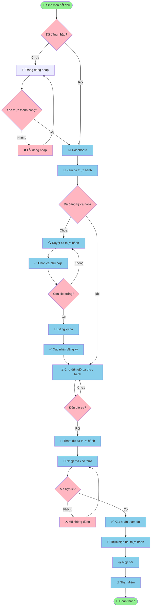
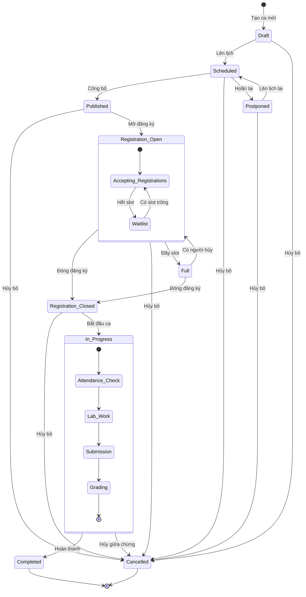

# UML Use Case Diagrams - Lab Manager System

## Tổng quan hệ thống

Lab Manager là một hệ thống quản lý phòng thực hành với 3 cấp độ người dùng chính:
- **Người dùng thông thường (nguoi_dung)**: Sinh viên, học viên
- **Quản trị viên (quan_tri_vien)**: Giảng viên, quản lý khoa
- **Quản trị hệ thống (quan_tri_he_thong)**: Quản trị viên cấp cao

## 1. Biểu đồ Use Case Tổng Quát



## 2. Biểu đồ Use Case Chi Tiết - Người Dùng Thông Thường

```mermaid
graph TD
    %% Actor
    User[👤 Người dùng<br/>nguoi_dung]
    
    %% Authentication Use Cases
    subgraph "🔐 Xác thực"
        Login[Đăng nhập]
        Logout[Đăng xuất] 
        Register[Đăng ký tài khoản]
        ResetPassword[Đặt lại mật khẩu]
    end
    
    %% Profile Management
    subgraph "👤 Quản lý hồ sơ"
        ViewProfile[Xem hồ sơ]
        EditProfile[Chỉnh sửa hồ sơ]
        ChangePassword[Đổi mật khẩu]
        ViewSettings[Xem cài đặt]
        UpdateSettings[Cập nhật cài đặt]
        Enable2FA[Bật/tắt 2FA]
    end
    
    %% Dashboard & Navigation
    subgraph "📊 Dashboard"
        ViewDashboard[Xem dashboard]
        ViewStats[Xem thống kê cá nhân]
        ViewActivities[Xem hoạt động gần đây]
        ManageSession[Quản lý phiên làm việc]
    end
    
    %% Lab Session Management
    subgraph "🧪 Quản lý ca thực hành"
        ViewLabSessions[Xem danh sách ca thực hành]
        RegisterLab[Đăng ký ca thực hành]
        ViewMyLabs[Xem ca đã đăng ký]
        VerifyAttendance[Xác nhận tham dự]
        SubmitLabWork[Nộp bài thực hành]
        ViewLabResults[Xem kết quả thực hành]
        CancelRegistration[Hủy đăng ký]
    end
    
    %% Search & Filter
    subgraph "🔍 Tìm kiếm"
        SearchLabs[Tìm kiếm ca thực hành]
        FilterByCourse[Lọc theo khóa học]
        FilterByDate[Lọc theo ngày]
        FilterByStatus[Lọc theo trạng thái]
    end
    
    %% User connections
    User --> Login
    User --> Logout
    User --> Register
    User --> ResetPassword
    
    User --> ViewProfile
    User --> EditProfile
    User --> ChangePassword
    User --> ViewSettings
    User --> UpdateSettings
    User --> Enable2FA
    
    User --> ViewDashboard
    User --> ViewStats
    User --> ViewActivities
    User --> ManageSession
    
    User --> ViewLabSessions
    User --> RegisterLab
    User --> ViewMyLabs
    User --> VerifyAttendance
    User --> SubmitLabWork
    User --> ViewLabResults
    User --> CancelRegistration
    
    User --> SearchLabs
    User --> FilterByCourse
    User --> FilterByDate
    User --> FilterByStatus
```



## 3. Biểu đồ Use Case Chi Tiết - Quản Trị Viên

```mermaid
graph TD
    %% Actor
    Admin[👨‍💼 Quản trị viên<br/>quan_tri_vien]
    
    %% Inherited User Functions
    subgraph "👤 Chức năng người dùng (Kế thừa)"
        UserAuth[Xác thực & Hồ sơ]
        UserDashboard[Dashboard cá nhân]
        UserLabs[Tham gia ca thực hành]
    end
    
    %% Admin Dashboard
    subgraph "📊 Admin Dashboard"
        ViewAdminDash[Xem admin dashboard]
        ViewUserStats[Xem thống kê người dùng]
        ViewLabStats[Xem thống kê ca thực hành]
        ViewSystemMetrics[Xem metrics hệ thống]
        ViewReports[Xem báo cáo]
    end
    
    %% User Management
    subgraph "👥 Quản lý người dùng"
        ViewUsers[Xem danh sách người dùng]
        CreateUser[Tạo người dùng mới]
        EditUser[Chỉnh sửa người dùng]
        DeleteUser[Xóa người dùng]
        BulkCreateUsers[Tạo người dùng hàng loạt]
        BulkEditUsers[Chỉnh sửa hàng loạt]
        ViewUserDetails[Xem chi tiết người dùng]
        ManageUserRoles[Quản lý vai trò người dùng]
        FilterUsers[Lọc & tìm kiếm người dùng]
    end
    
    %% Lab Session Management
    subgraph "🧪 Quản lý ca thực hành"
        ViewAllLabs[Xem tất cả ca thực hành]
        CreateLabSession[Tạo ca thực hành]
        EditLabSession[Chỉnh sửa ca thực hành]
        DeleteLabSession[Xóa ca thực hành]
        ScheduleLabs[Lập lịch ca thực hành]
        ManageLabRooms[Quản lý phòng thực hành]
        ViewAttendance[Xem danh sách tham dự]
        ManageRegistrations[Quản lý đăng ký]
        GenerateLabCode[Tạo mã xác thực]
        ViewLabReports[Xem báo cáo ca thực hành]
    end
    
    %% System Monitoring
    subgraph "📈 Giám sát & Báo cáo"
        ViewActivityLogs[Xem nhật ký hoạt động]
        MonitorSessions[Giám sát phiên làm việc]
        ViewDetailedReports[Xem báo cáo chi tiết]
        ExportData[Xuất dữ liệu]
        ViewAnalytics[Xem phân tích]
    end
    
    %% Settings Management
    subgraph "⚙️ Cài đặt"
        ViewSettings[Xem cài đặt hệ thống]
        UpdateSettings[Cập nhật cài đặt]
        ManagePermissions[Quản lý quyền hạn]
    end
    
    %% Admin connections (inherits all user capabilities)
    Admin --> UserAuth
    Admin --> UserDashboard  
    Admin --> UserLabs
    
    Admin --> ViewAdminDash
    Admin --> ViewUserStats
    Admin --> ViewLabStats
    Admin --> ViewSystemMetrics
    Admin --> ViewReports
    
    Admin --> ViewUsers
    Admin --> CreateUser
    Admin --> EditUser
    Admin --> DeleteUser
    Admin --> BulkCreateUsers
    Admin --> BulkEditUsers
    Admin --> ViewUserDetails
    Admin --> ManageUserRoles
    Admin --> FilterUsers
    
    Admin --> ViewAllLabs
    Admin --> CreateLabSession
    Admin --> EditLabSession
    Admin --> DeleteLabSession
    Admin --> ScheduleLabs
    Admin --> ManageLabRooms
    Admin --> ViewAttendance
    Admin --> ManageRegistrations
    Admin --> GenerateLabCode
    Admin --> ViewLabReports
    
    Admin --> ViewActivityLogs
    Admin --> MonitorSessions
    Admin --> ViewDetailedReports
    Admin --> ExportData
    Admin --> ViewAnalytics
    
    Admin --> ViewSettings
    Admin --> UpdateSettings
    Admin --> ManagePermissions
```



## 4. Biểu đồ Use Case Chi Tiết - Quản Trị Hệ Thống

```mermaid
graph TD
    %% Actor
    SysAdmin[👑 Quản trị hệ thống<br/>quan_tri_he_thong]
    
    %% Inherited Functions
    subgraph "👥 Chức năng kế thừa"
        UserFunctions[Tất cả chức năng người dùng]
        AdminFunctions[Tất cả chức năng quản trị viên]
    end
    
    %% System Administration
    subgraph "🖥️ Quản trị hệ thống"
        ViewSystemDash[Xem system dashboard]
        MonitorSystem[Giám sát hệ thống]
        ViewSystemLogs[Xem system logs]
        ManageSystemResources[Quản lý tài nguyên hệ thống]
        ViewPerformanceMetrics[Xem metrics hiệu suất]
    end
    
    %% Advanced User Management
    subgraph "👑 Quản lý người dùng nâng cao"
        PromoteToAdmin[Nâng cấp lên quản trị viên]
        PromoteToSysAdmin[Nâng cấp lên quản trị hệ thống]
        DemoteUser[Hạ cấp người dùng]
        ManageAllRoles[Quản lý tất cả vai trò]
        ViewUserSecurity[Xem bảo mật người dùng]
        ManageUserAccess[Quản lý quyền truy cập]
        BulkRoleChanges[Thay đổi vai trò hàng loạt]
    end
    
    %% Database Management
    subgraph "🗄️ Quản lý cơ sở dữ liệu"
        BackupDatabase[Sao lưu cơ sở dữ liệu]
        RestoreDatabase[Khôi phục cơ sở dữ liệu]
        ResetDatabase[Reset cơ sở dữ liệu]
        ManageDbMigrations[Quản lý DB migrations]
        ViewDbStatus[Xem trạng thái DB]
        OptimizeDatabase[Tối ưu hóa cơ sở dữ liệu]
        ManageDbConnections[Quản lý kết nối DB]
    end
    
    %% System Configuration
    subgraph "⚙️ Cấu hình hệ thống"
        ManageSystemSettings[Quản lý cài đặt hệ thống]
        ConfigureAuthentication[Cấu hình xác thực]
        ManageSecurityPolicies[Quản lý chính sách bảo mật]
        ConfigureEmailSettings[Cấu hình email]
        ManageApiSettings[Quản lý cài đặt API]
        ConfigureCache[Cấu hình cache]
        ManageLogging[Quản lý logging]
    end
    
    %% System Operations
    subgraph "🔧 Vận hành hệ thống"
        SystemBackup[Sao lưu hệ thống]
        SystemRestore[Khôi phục hệ thống]
        SystemMaintenance[Bảo trì hệ thống]
        ClearLogs[Xóa logs]
        ClearCache[Xóa cache]
        RestartServices[Khởi động lại dịch vụ]
        UpdateSystem[Cập nhật hệ thống]
    end
    
    %% Security Management
    subgraph "🔒 Quản lý bảo mật"
        ViewSecurityLogs[Xem logs bảo mật]
        ManageFirewallRules[Quản lý firewall]
        ConfigureSsl[Cấu hình SSL]
        ManageApiKeys[Quản lý API keys]
        AuditSystemSecurity[Audit bảo mật hệ thống]
        MonitorSecurityThreats[Giám sát mối đe dọa]
    end
    
    %% Advanced Analytics
    subgraph "📊 Phân tích nâng cao"
        ViewSystemAnalytics[Xem phân tích hệ thống]
        GenerateSystemReports[Tạo báo cáo hệ thống]
        ExportSystemData[Xuất dữ liệu hệ thống]
        ViewUsageStatistics[Xem thống kê sử dụng]
        MonitorPerformance[Giám sát hiệu suất]
    end
    
    %% System Admin connections (inherits all capabilities)
    SysAdmin --> UserFunctions
    SysAdmin --> AdminFunctions
    
    SysAdmin --> ViewSystemDash
    SysAdmin --> MonitorSystem
    SysAdmin --> ViewSystemLogs
    SysAdmin --> ManageSystemResources
    SysAdmin --> ViewPerformanceMetrics
    
    SysAdmin --> PromoteToAdmin
    SysAdmin --> PromoteToSysAdmin
    SysAdmin --> DemoteUser
    SysAdmin --> ManageAllRoles
    SysAdmin --> ViewUserSecurity
    SysAdmin --> ManageUserAccess
    SysAdmin --> BulkRoleChanges
    
    SysAdmin --> BackupDatabase
    SysAdmin --> RestoreDatabase
    SysAdmin --> ResetDatabase
    SysAdmin --> ManageDbMigrations
    SysAdmin --> ViewDbStatus
    SysAdmin --> OptimizeDatabase
    SysAdmin --> ManageDbConnections
    
    SysAdmin --> ManageSystemSettings
    SysAdmin --> ConfigureAuthentication
    SysAdmin --> ManageSecurityPolicies
    SysAdmin --> ConfigureEmailSettings
    SysAdmin --> ManageApiSettings
    SysAdmin --> ConfigureCache
    SysAdmin --> ManageLogging
    
    SysAdmin --> SystemBackup
    SysAdmin --> SystemRestore
    SysAdmin --> SystemMaintenance
    SysAdmin --> ClearLogs
    SysAdmin --> ClearCache
    SysAdmin --> RestartServices
    SysAdmin --> UpdateSystem
    
    SysAdmin --> ViewSecurityLogs
    SysAdmin --> ManageFirewallRules
    SysAdmin --> ConfigureSsl
    SysAdmin --> ManageApiKeys
    SysAdmin --> AuditSystemSecurity
    SysAdmin --> MonitorSecurityThreats
    
    SysAdmin --> ViewSystemAnalytics
    SysAdmin --> GenerateSystemReports
    SysAdmin --> ExportSystemData
    SysAdmin --> ViewUsageStatistics
    SysAdmin --> MonitorPerformance
```



## 5. Ma trận Phân Quyền Chi Tiết

| Chức năng | Người dùng | Quản trị viên | Quản trị hệ thống |
|-----------|------------|---------------|-------------------|
| **Xác thực & Hồ sơ** |
| Đăng nhập/Đăng xuất | ✅ | ✅ | ✅ |
| Quản lý hồ sơ cá nhân | ✅ | ✅ | ✅ |
| Đổi mật khẩu | ✅ | ✅ | ✅ |
| Cài đặt 2FA | ✅ | ✅ | ✅ |
| **Ca thực hành** |
| Xem ca thực hành | ✅ | ✅ | ✅ |
| Đăng ký ca thực hành | ✅ | ✅ | ✅ |
| Tạo ca thực hành | ❌ | ✅ | ✅ |
| Quản lý ca thực hành | ❌ | ✅ | ✅ |
| **Quản lý người dùng** |
| Xem danh sách người dùng | ❌ | ✅ | ✅ |
| Tạo/Sửa/Xóa người dùng | ❌ | ✅ | ✅ |
| Nâng cấp lên admin | ❌ | ❌ | ✅ |
| Nâng cấp lên system admin | ❌ | ❌ | ✅ |
| **Quản lý hệ thống** |
| Xem cài đặt hệ thống | ❌ | ✅ | ✅ |
| Cập nhật cài đặt | ❌ | ❌ | ✅ |
| Sao lưu/Khôi phục DB | ❌ | ❌ | ✅ |
| Reset hệ thống | ❌ | ❌ | ✅ |
| **Báo cáo & Giám sát** |
| Xem báo cáo cá nhân | ✅ | ✅ | ✅ |
| Xem báo cáo tổng quan | ❌ | ✅ | ✅ |
| Xem system metrics | ❌ | ❌ | ✅ |
| Xuất dữ liệu hệ thống | ❌ | ❌ | ✅ |

## 6. Luồng Use Case Chính

### 6.1 Luồng đăng nhập và phân quyền
```
1. User truy cập hệ thống
2. Nhập thông tin đăng nhập
3. Hệ thống xác thực
4. Điều hướng dựa trên vai trò:
   - nguoi_dung → User Dashboard
   - quan_tri_vien → Admin Dashboard  
   - quan_tri_he_thong → System Admin Dashboard
```

### 6.2 Luồng quản lý ca thực hành (User)
```
1. User xem danh sách ca thực hành
2. Lọc/Tìm kiếm ca phù hợp
3. Đăng ký ca thực hành
4. Tham dự ca (xác nhận mã)
5. Nộp bài thực hành
6. Xem kết quả
```

### 6.3 Luồng quản lý người dùng (Admin)
```
1. Admin truy cập quản lý người dùng
2. Xem danh sách người dùng
3. Tạo/Chỉnh sửa thông tin người dùng
4. Cấp quyền (chỉ có thể nâng lên admin)
5. Theo dõi hoạt động
```

### 6.4 Luồng quản lý hệ thống (System Admin)
```
1. System Admin truy cập system dashboard
2. Giám sát metrics hệ thống
3. Thực hiện các tác vụ bảo trì
4. Quản lý cấu hình hệ thống
5. Sao lưu/Khôi phục dữ liệu
```

## 7. Mô tả Actors

### 👤 Người dùng (nguoi_dung)
- **Mô tả**: Sinh viên, học viên tham gia các ca thực hành
- **Quyền hạn chính**: Đăng ký và tham gia ca thực hành, quản lý hồ sơ cá nhân
- **Hành vi**: Sử dụng hệ thống để đăng ký, tham dự và hoàn thành các ca thực hành

### 👨‍💼 Quản trị viên (quan_tri_vien)  
- **Mô tả**: Giảng viên, quản lý khoa, có thể quản lý người dùng và ca thực hành
- **Quyền hạn chính**: Kế thừa tất cả quyền của người dùng + quản lý người dùng và ca thực hành
- **Hành vi**: Tạo và quản lý ca thực hành, quản lý sinh viên, theo dõi tiến độ học tập

### 👑 Quản trị hệ thống (quan_tri_he_thong)
- **Mô tả**: Quản trị viên cấp cao, có toàn quyền quản lý hệ thống
- **Quyền hạn chính**: Kế thừa tất cả quyền + quản lý cấu hình hệ thống, cơ sở dữ liệu
- **Hành vi**: Duy trì và vận hành hệ thống, đảm bảo bảo mật và hiệu suất

---

*Hệ thống Lab Manager được thiết kế theo mô hình phân quyền kế thừa, đảm bảo tính bảo mật và dễ quản lý.*

## 8. Biểu đồ Sequence - Quy trình Đăng ký Ca thực hành



## 9. Biểu đồ Class - Mô hình dữ liệu chính

```mermaid
classDiagram
    class User {
        +int id
        +string username
        +string email
        +string password_hash
        +string first_name
        +string last_name
        +datetime created_at
        +datetime updated_at
        +bool is_active
        +bool email_verified
        +string role
        +login()
        +logout()
        +update_profile()
        +change_password()
    }

    class LabSession {
        +int id
        +string title
        +string description
        +datetime start_time
        +datetime end_time
        +int max_participants
        +int current_participants
        +string room
        +string status
        +string verification_code
        +int instructor_id
        +create()
        +update()
        +delete()
        +generate_code()
    }

    class Registration {
        +int id
        +int user_id
        +int lab_session_id
        +datetime registered_at
        +string status
        +datetime attendance_time
        +bool work_submitted
        +float grade
        +register()
        +cancel()
        +mark_attendance()
        +submit_work()
    }

    class Course {
        +int id
        +string name
        +string code
        +string description
        +int instructor_id
        +datetime created_at
        +bool is_active
        +create()
        +update()
        +archive()
    }

    class Room {
        +int id
        +string name
        +string location
        +int capacity
        +string equipment
        +bool is_available
        +reserve()
        +release()
    }

    class ActivityLog {
        +int id
        +int user_id
        +string action
        +string details
        +datetime timestamp
        +string ip_address
        +log_activity()
    }

    %% Relationships
    User ||--o{ Registration : "has many"
    LabSession ||--o{ Registration : "has many"
    User ||--o{ LabSession : "instructs"
    Course ||--o{ LabSession : "contains"
    Room ||--o{ LabSession : "hosts"
    User ||--o{ ActivityLog : "generates"
    User ||--o{ Course : "teaches"

    %% Inheritance
    User <|-- Student
    User <|-- Instructor
    User <|-- SystemAdmin

    class Student {
        +string student_id
        +string major
        +int year
        +view_labs()
        +register_lab()
    }

    class Instructor {
        +string employee_id
        +string department
        +create_lab()
        +manage_students()
    }

    class SystemAdmin {
        +manage_system()
        +backup_data()
        +monitor_performance()
    }
```

## 10. Biểu đồ Activity - Quy trình Tham dự Ca thực hành



## 11. Biểu đồ Component - Kiến trúc Hệ thống

```mermaid
graph TB
    subgraph "🌐 Presentation Layer"
        WebUI[Web Interface]
        MobileUI[Mobile Interface]
        AdminUI[Admin Interface]
    end

    subgraph "🔐 Authentication Layer"
        AuthService[Authentication Service]
        JWTHandler[JWT Handler]
        SessionMgr[Session Manager]
        TwoFactorAuth[2FA Service]
    end

    subgraph "📡 API Layer"
        RestAPI[REST API]
        GraphQLAPI[GraphQL API]
        WebSocket[WebSocket API]
    end

    subgraph "🏗️ Business Logic Layer"
        UserService[User Service]
        LabService[Lab Session Service]
        AdminService[Admin Service]
        NotificationService[Notification Service]
        ReportService[Report Service]
        CacheService[Cache Service]
    end

    subgraph "🗄️ Data Access Layer"
        UserRepo[User Repository]
        LabRepo[Lab Repository]
        AdminRepo[Admin Repository]
        LogRepo[Activity Log Repository]
    end

    subgraph "💾 Data Storage"
        MainDB[(Main Database)]
        CacheDB[(Redis Cache)]
        FileStorage[(File Storage)]
        LogDB[(Log Database)]
    end

    subgraph "🔧 External Services"
        EmailSvc[Email Service]
        SMSSvc[SMS Service]
        StorageSvc[Cloud Storage]
        MonitorSvc[Monitoring Service]
    end

    %% Connections
    WebUI --> RestAPI
    MobileUI --> RestAPI
    AdminUI --> RestAPI
    
    RestAPI --> AuthService
    GraphQLAPI --> AuthService
    WebSocket --> AuthService
    
    AuthService --> JWTHandler
    AuthService --> SessionMgr
    AuthService --> TwoFactorAuth
    
    RestAPI --> UserService
    RestAPI --> LabService
    RestAPI --> AdminService
    GraphQLAPI --> UserService
    GraphQLAPI --> LabService
    
    UserService --> UserRepo
    LabService --> LabRepo
    AdminService --> AdminRepo
    
    UserService --> NotificationService
    LabService --> NotificationService
    AdminService --> ReportService
    
    UserRepo --> MainDB
    LabRepo --> MainDB
    AdminRepo --> MainDB
    LogRepo --> LogDB
    
    CacheService --> CacheDB
    NotificationService --> EmailSvc
    NotificationService --> SMSSvc
    
    FileStorage --> StorageSvc
    MonitorSvc --> LogDB
```



## 12. Biểu đồ State - Trạng thái Ca thực hành



---

*Các biểu đồ bổ sung này cung cấp góc nhìn toàn diện về kiến trúc, quy trình và trạng thái của hệ thống Lab Manager.*