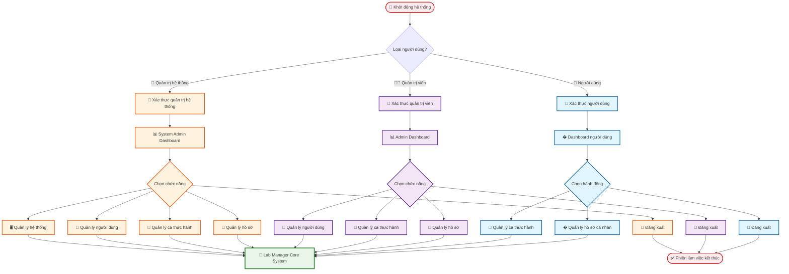
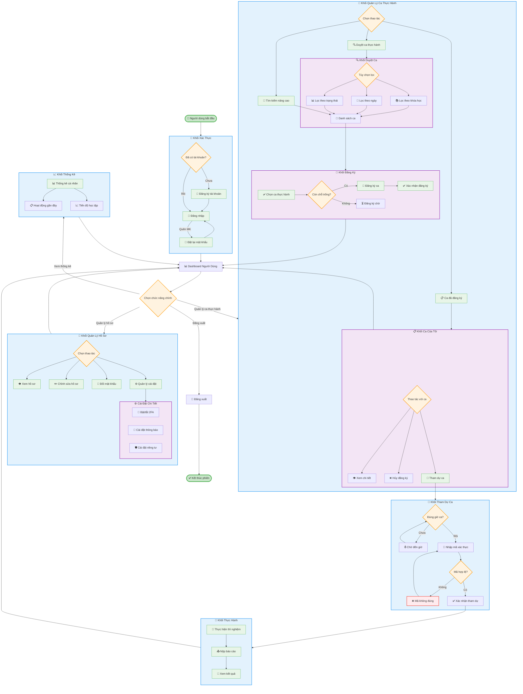
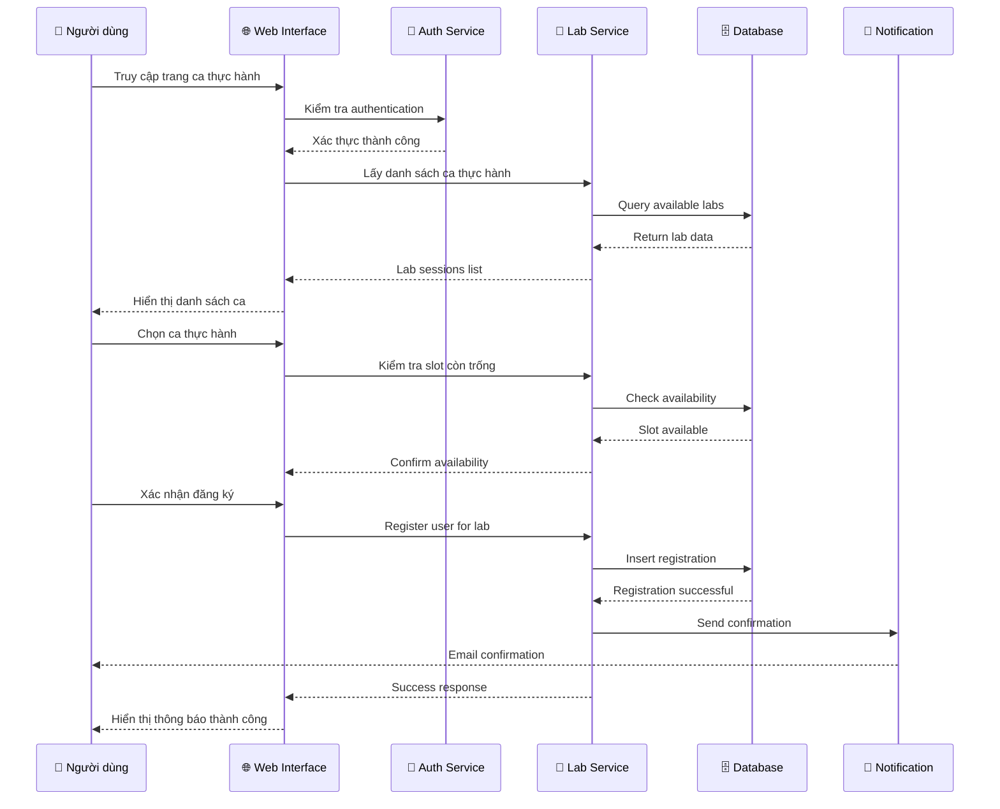
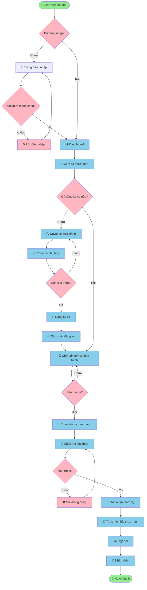
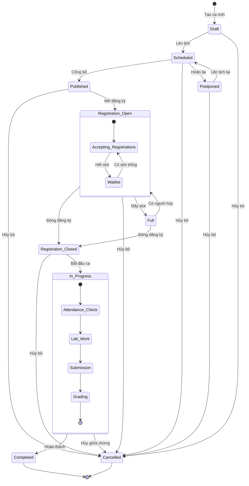

# UML Use Case Diagrams - Lab Manager System

## Tổng quan hệ thống

Lab Manager là một hệ thống quản lý phòng thực hành với 3 cấp độ người dùng chính:
- **Người dùng thông thường (nguoi_dung)**: Sinh viên, học viên
- **Quản trị viên (quan_tri_vien)**: Giảng viên, quản lý khoa
- **Quản trị hệ thống (quan_tri_he_thong)**: Quản trị viên cấp cao

## 1. Biểu đồ Use Case Tổng Quát


```mermaid
flowchart TD
    Start([🚀 Khởi động hệ thống]) --> UserEntry{Loại người dùng?}
    
    %% User Flow Branch
    UserEntry -->|👤 Người dùng| UserAuth[🔐 Xác thực người dùng]
    UserAuth --> UserDash[� Dashboard người dùng]
    UserDash --> UserActions{Chọn hành động}
    
    UserActions --> UserProfile[� Quản lý hồ sơ cá nhân]
    UserActions --> UserLabs[🧪 Quản lý ca thực hành]
    UserActions --> UserLogout[🚪 Đăng xuất]
    
    %% Admin Flow Branch  
    UserEntry -->|👨‍💼 Quản trị viên| AdminAuth[🔐 Xác thực quản trị viên]
    AdminAuth --> AdminDash[📊 Admin Dashboard]
    AdminDash --> AdminActions{Chọn chức năng}
    
    AdminActions --> AdminProfile[👤 Quản lý hồ sơ]
    AdminActions --> AdminLabs[🧪 Quản lý ca thực hành]
    AdminActions --> AdminUsers[👥 Quản lý người dùng]
    AdminActions --> AdminLogout[🚪 Đăng xuất]
    
    %% System Admin Flow Branch
    UserEntry -->|👑 Quản trị hệ thống| SysAdminAuth[🔐 Xác thực quản trị hệ thống]
    SysAdminAuth --> SysAdminDash[📊 System Admin Dashboard]
    SysAdminDash --> SysAdminActions{Chọn chức năng}
    
    SysAdminActions --> SysAdminProfile[👤 Quản lý hồ sơ]
    SysAdminActions --> SysAdminLabs[🧪 Quản lý ca thực hành]
    SysAdminActions --> SysAdminUsers[👥 Quản lý người dùng]
    SysAdminActions --> SysAdminSystem[🖥️ Quản lý hệ thống]
    SysAdminActions --> SysAdminLogout[🚪 Đăng xuất]
    
    %% System Core Components
    UserProfile --> SystemCore[🏢 Lab Manager Core System]
    UserLabs --> SystemCore
    AdminProfile --> SystemCore
    AdminLabs --> SystemCore
    AdminUsers --> SystemCore
    SysAdminProfile --> SystemCore
    SysAdminLabs --> SystemCore
    SysAdminUsers --> SystemCore
    SysAdminSystem --> SystemCore
    
    %% End States
    UserLogout --> End([✅ Phiên làm việc kết thúc])
    AdminLogout --> End
    SysAdminLogout --> End
    
    %% Styling
    classDef userStyle fill:#e1f5fe,stroke:#01579b,stroke-width:2px
    classDef adminStyle fill:#f3e5f5,stroke:#4a148c,stroke-width:2px
    classDef sysAdminStyle fill:#fff3e0,stroke:#e65100,stroke-width:2px
    classDef systemStyle fill:#e8f5e8,stroke:#2e7d32,stroke-width:3px
    classDef startEnd fill:#ffebee,stroke:#c62828,stroke-width:2px
    
    class UserAuth,UserDash,UserActions,UserProfile,UserLabs,UserLogout userStyle
    class AdminAuth,AdminDash,AdminActions,AdminProfile,AdminLabs,AdminUsers,AdminLogout adminStyle
    class SysAdminAuth,SysAdminDash,SysAdminActions,SysAdminProfile,SysAdminLabs,SysAdminUsers,SysAdminSystem,SysAdminLogout sysAdminStyle
    class SystemCore systemStyle
    class Start,End startEnd
```

## 2. Biểu đồ Flowchart Chi Tiết - Người Dùng Thông Thường


```mermaid
flowchart TD
    Start([👤 Người dùng bắt đầu]) --> AuthBlock
    
    %% Authentication Block
    subgraph AuthBlock["🔐 Khối Xác Thực"]
        direction TB
        HasAccount{Đã có tài khoản?}
        Register[📝 Đăng ký tài khoản]
        Login[🔑 Đăng nhập]
        ResetPass[🔄 Đặt lại mật khẩu]
        
        HasAccount -->|Chưa| Register
        HasAccount -->|Rồi| Login
        Login -->|Quên MK| ResetPass
        ResetPass --> Login
        Register --> Login
    end
    
    AuthBlock --> Dashboard[📊 Dashboard Người Dùng]
    
    Dashboard --> MainActions{Chọn chức năng chính}
    
    %% Profile Management Block
    MainActions -->|Quản lý hồ sơ| ProfileBlock
    subgraph ProfileBlock["👤 Khối Quản Lý Hồ Sơ"]
        direction TB
        ProfileMenu{Chọn thao tác}
        ViewProfile[👁️ Xem hồ sơ]
        EditProfile[✏️ Chỉnh sửa hồ sơ]
        ChangePassword[🔑 Đổi mật khẩu]
        ManageSettings[⚙️ Quản lý cài đặt]
        
        ProfileMenu --> ViewProfile
        ProfileMenu --> EditProfile
        ProfileMenu --> ChangePassword
        ProfileMenu --> ManageSettings
        
        subgraph SettingsBlock["⚙️ Cài Đặt Chi Tiết"]
            Enable2FA[🔐 Bật/tắt 2FA]
            NotificationSettings[🔔 Cài đặt thông báo]
            PrivacySettings[🛡️ Cài đặt riêng tư]
        end
        
        ManageSettings --> SettingsBlock
    end
    
    %% Lab Management Block
    MainActions -->|Quản lý ca thực hành| LabBlock
    subgraph LabBlock["🧪 Khối Quản Lý Ca Thực Hành"]
        direction TB
        LabMenu{Chọn thao tác}
        BrowseLabs[🔍 Duyệt ca thực hành]
        ViewMyLabs[📋 Ca đã đăng ký]
        SearchLabs[🔎 Tìm kiếm nâng cao]
        
        LabMenu --> BrowseLabs
        LabMenu --> ViewMyLabs
        LabMenu --> SearchLabs
        
        %% Browse Labs Sub-block
        subgraph BrowseBlock["🔍 Khối Duyệt Ca"]
            FilterOptions{Tùy chọn lọc}
            FilterCourse[📚 Lọc theo khóa học]
            FilterDate[📅 Lọc theo ngày]
            FilterStatus[📊 Lọc theo trạng thái]
            LabList[📝 Danh sách ca]
            
            FilterOptions --> FilterCourse
            FilterOptions --> FilterDate
            FilterOptions --> FilterStatus
            FilterCourse --> LabList
            FilterDate --> LabList
            FilterStatus --> LabList
        end
        
        BrowseLabs --> BrowseBlock
        SearchLabs --> LabList
        
        %% Registration Sub-block
        subgraph RegBlock["📝 Khối Đăng Ký"]
            SelectLab[✅ Chọn ca thực hành]
            CheckSlots{Còn chỗ trống?}
            RegisterLab[📝 Đăng ký ca]
            WaitList[⏳ Đăng ký chờ]
            ConfirmReg[✅ Xác nhận đăng ký]
            
            SelectLab --> CheckSlots
            CheckSlots -->|Có| RegisterLab
            CheckSlots -->|Không| WaitList
            RegisterLab --> ConfirmReg
        end
        
        LabList --> RegBlock
        
        %% My Labs Sub-block
        subgraph MyLabsBlock["📋 Khối Ca Của Tôi"]
            MyLabActions{Thao tác với ca}
            ViewDetails[👁️ Xem chi tiết]
            CancelReg[❌ Hủy đăng ký]
            AttendLab[🏫 Tham dự ca]
            
            MyLabActions --> ViewDetails
            MyLabActions --> CancelReg
            MyLabActions --> AttendLab
        end
        
        ViewMyLabs --> MyLabsBlock
    end
    
    %% Lab Attendance Block
    AttendLab --> AttendanceBlock
    subgraph AttendanceBlock["🏫 Khối Tham Dự Ca"]
        direction TB
        CheckTime{Đúng giờ ca?}
        WaitForTime[⏰ Chờ đến giờ]
        EnterCode[🔢 Nhập mã xác thực]
        VerifyCode{Mã hợp lệ?}
        CodeError[❌ Mã không đúng]
        MarkAttendance[✅ Xác nhận tham dự]
        
        CheckTime -->|Chưa| WaitForTime
        CheckTime -->|Rồi| EnterCode
        WaitForTime --> CheckTime
        EnterCode --> VerifyCode
        VerifyCode -->|Không| CodeError
        VerifyCode -->|Có| MarkAttendance
        CodeError --> EnterCode
    end
    
    %% Lab Work Block
    MarkAttendance --> LabWorkBlock
    subgraph LabWorkBlock["🔬 Khối Thực Hành"]
        direction TB
        DoLabWork[🔬 Thực hiện thí nghiệm]
        SubmitWork[📤 Nộp báo cáo]
        ViewResults[🎯 Xem kết quả]
        
        DoLabWork --> SubmitWork
        SubmitWork --> ViewResults
    end
    
    %% Statistics Block
    MainActions -->|Xem thống kê| StatsBlock
    subgraph StatsBlock["📈 Khối Thống Kê"]
        direction TB
        ViewStats[📊 Thống kê cá nhân]
        ViewActivities[📋 Hoạt động gần đây]
        ViewProgress[📈 Tiến độ học tập]
        
        ViewStats --> ViewActivities
        ViewStats --> ViewProgress
    end
    
    %% Return flows
    ProfileBlock --> Dashboard
    RegBlock --> Dashboard
    MyLabsBlock --> Dashboard
    LabWorkBlock --> Dashboard
    StatsBlock --> Dashboard
    
    %% Logout
    MainActions -->|Đăng xuất| Logout[🚪 Đăng xuất]
    Logout --> End([✅ Kết thúc phiên])
    
    %% Styling
    classDef startEnd fill:#c8e6c9,stroke:#4caf50,stroke-width:3px
    classDef blockStyle fill:#e3f2fd,stroke:#2196f3,stroke-width:2px
    classDef subBlockStyle fill:#f3e5f5,stroke:#9c27b0,stroke-width:2px
    classDef decision fill:#fff3e0,stroke:#ff9800,stroke-width:2px
    classDef action fill:#e8f5e8,stroke:#4caf50,stroke-width:1px
    classDef error fill:#ffebee,stroke:#f44336,stroke-width:2px
    
    class Start,End startEnd
    class AuthBlock,ProfileBlock,LabBlock,AttendanceBlock,LabWorkBlock,StatsBlock blockStyle
    class SettingsBlock,BrowseBlock,RegBlock,MyLabsBlock subBlockStyle
    class HasAccount,MainActions,ProfileMenu,LabMenu,FilterOptions,CheckSlots,MyLabActions,CheckTime,VerifyCode decision
    class Register,Login,ResetPass,ViewProfile,EditProfile,ChangePassword,ManageSettings,BrowseLabs,ViewMyLabs,SearchLabs,SelectLab,RegisterLab,ConfirmReg,AttendLab,DoLabWork,SubmitWork,ViewResults,ViewStats action
    class CodeError error
```

## 3. Biểu đồ Flowchart Chi Tiết - Quản Trị Viên


```mermaid
flowchart TD
    AdminStart([👨‍💼 Quản trị viên bắt đầu]) --> AdminAuth[🔐 Xác thực quản trị viên]
    
    AdminAuth --> AdminDashboard[📊 Admin Dashboard]
    
    AdminDashboard --> AdminMainActions{Chọn chức năng chính}
    
    %% Inherited User Functions Block
    AdminMainActions -->|Chức năng người dùng| UserFunctionsBlock
    subgraph UserFunctionsBlock["👤 Khối Chức Năng Người Dùng (Kế Thừa)"]
        direction TB
        UserAuthInherited[🔐 Xác thực & Hồ sơ]
        UserDashboardInherited[📊 Dashboard cá nhân]
        UserLabsInherited[🧪 Tham gia ca thực hành]
        
        UserAuthInherited --> UserDashboardInherited
        UserDashboardInherited --> UserLabsInherited
    end
    
    %% Admin Dashboard Block
    AdminMainActions -->|Dashboard quản trị| AdminDashBlock
    subgraph AdminDashBlock["📊 Khối Admin Dashboard"]
        direction TB
        DashActions{Chọn loại thống kê}
        ViewAdminDash[📊 Xem admin dashboard]
        ViewUserStats[👥 Thống kê người dùng]
        ViewLabStats[🧪 Thống kê ca thực hành]
        ViewSystemMetrics[⚙️ Metrics hệ thống]
        ViewReports[📋 Xem báo cáo]
        
        DashActions --> ViewAdminDash
        DashActions --> ViewUserStats
        DashActions --> ViewLabStats
        DashActions --> ViewSystemMetrics
        DashActions --> ViewReports
    end
    
    %% User Management Block
    AdminMainActions -->|Quản lý người dùng| UserMgmtBlock
    subgraph UserMgmtBlock["👥 Khối Quản Lý Người Dùng"]
        direction TB
        UserMgmtActions{Chọn thao tác}
        ViewUsers[👁️ Xem danh sách người dùng]
        CreateUser[➕ Tạo người dùng mới]
        EditUser[✏️ Chỉnh sửa người dùng]
        DeleteUser[🗑️ Xóa người dùng]
        
        UserMgmtActions --> ViewUsers
        UserMgmtActions --> CreateUser
        UserMgmtActions --> EditUser
        UserMgmtActions --> DeleteUser
        
        %% Bulk Operations Sub-block
        subgraph BulkOpsBlock["🔄 Khối Thao Tác Hàng Loạt"]
            BulkActions{Thao tác hàng loạt}
            BulkCreateUsers[👥 Tạo hàng loạt]
            BulkEditUsers[✏️ Sửa hàng loạt]
            ImportUsers[📥 Import từ file]
            ExportUsers[📤 Export danh sách]
            
            BulkActions --> BulkCreateUsers
            BulkActions --> BulkEditUsers
            BulkActions --> ImportUsers
            BulkActions --> ExportUsers
        end
        
        UserMgmtActions --> BulkOpsBlock
        
        %% User Details Sub-block
        subgraph UserDetailsBlock["🔍 Khối Chi Tiết Người Dùng"]
            ViewUserDetails[👁️ Xem chi tiết]
            ManageUserRoles[🎭 Quản lý vai trò]
            ViewUserActivity[📋 Hoạt động người dùng]
            ManageUserAccess[🔑 Quản lý quyền truy cập]
            
            ViewUserDetails --> ManageUserRoles
            ViewUserDetails --> ViewUserActivity
            ViewUserDetails --> ManageUserAccess
        end
        
        ViewUsers --> UserDetailsBlock
        
        %% Search & Filter Sub-block
        subgraph UserSearchBlock["🔍 Khối Tìm Kiếm Người Dùng"]
            FilterUsers[🔍 Lọc & tìm kiếm]
            FilterByRole[🎭 Lọc theo vai trò]
            FilterByStatus[📊 Lọc theo trạng thái]
            FilterByDate[📅 Lọc theo ngày tạo]
            
            FilterUsers --> FilterByRole
            FilterUsers --> FilterByStatus
            FilterUsers --> FilterByDate
        end
        
        ViewUsers --> UserSearchBlock
    end
    
    %% Lab Session Management Block
    AdminMainActions -->|Quản lý ca thực hành| AdminLabBlock
    subgraph AdminLabBlock["🧪 Khối Quản Lý Ca Thực Hành"]
        direction TB
        LabMgmtActions{Chọn thao tác ca}
        ViewAllLabs[👁️ Xem tất cả ca]
        CreateLabSession[➕ Tạo ca thực hành]
        EditLabSession[✏️ Chỉnh sửa ca]
        DeleteLabSession[🗑️ Xóa ca]
        
        LabMgmtActions --> ViewAllLabs
        LabMgmtActions --> CreateLabSession
        LabMgmtActions --> EditLabSession
        LabMgmtActions --> DeleteLabSession
        
        %% Lab Scheduling Sub-block
        subgraph ScheduleBlock["📅 Khối Lập Lịch"]
            ScheduleLabs[📅 Lập lịch ca]
            ManageLabRooms[🏢 Quản lý phòng thực hành]
            CheckRoomAvailability[✅ Kiểm tra phòng trống]
            AssignInstructor[👨‍🏫 Phân công giảng viên]
            
            ScheduleLabs --> ManageLabRooms
            ScheduleLabs --> CheckRoomAvailability
            ScheduleLabs --> AssignInstructor
        end
        
        CreateLabSession --> ScheduleBlock
        
        %% Lab Monitoring Sub-block
        subgraph LabMonitorBlock["📊 Khối Giám Sát Ca"]
            ViewAttendance[📊 Xem danh sách tham dự]
            ManageRegistrations[📝 Quản lý đăng ký]
            GenerateLabCode[🔢 Tạo mã xác thực]
            MonitorLabProgress[📈 Giám sát tiến độ]
            
            ViewAttendance --> ManageRegistrations
            ViewAttendance --> GenerateLabCode
            ViewAttendance --> MonitorLabProgress
        end
        
        ViewAllLabs --> LabMonitorBlock
        
        %% Lab Reports Sub-block
        subgraph LabReportsBlock["📋 Khối Báo Cáo Ca"]
            ViewLabReports[📊 Xem báo cáo ca]
            GenerateAttendanceReport[📊 Báo cáo tham dự]
            GenerateGradeReport[🎯 Báo cáo điểm số]
            ExportLabData[📤 Xuất dữ liệu ca]
            
            ViewLabReports --> GenerateAttendanceReport
            ViewLabReports --> GenerateGradeReport
            ViewLabReports --> ExportLabData
        end
        
        ViewAllLabs --> LabReportsBlock
    end
    
    %% System Monitoring Block
    AdminMainActions -->|Giám sát & báo cáo| MonitoringBlock
    subgraph MonitoringBlock["📈 Khối Giám Sát & Báo Cáo"]
        direction TB
        MonitorActions{Chọn loại giám sát}
        ViewActivityLogs[📋 Nhật ký hoạt động]
        MonitorSessions[👥 Giám sát phiên làm việc]
        ViewDetailedReports[📊 Báo cáo chi tiết]
        ExportData[📤 Xuất dữ liệu]
        ViewAnalytics[📈 Xem phân tích]
        
        MonitorActions --> ViewActivityLogs
        MonitorActions --> MonitorSessions
        MonitorActions --> ViewDetailedReports
        MonitorActions --> ExportData
        MonitorActions --> ViewAnalytics
    end
    
    %% Settings Management Block
    AdminMainActions -->|Cài đặt| SettingsBlock
    subgraph SettingsBlock["⚙️ Khối Cài Đặt"]
        direction TB
        SettingsActions{Chọn cài đặt}
        ViewSettings[👁️ Xem cài đặt hệ thống]
        UpdateSettings[✏️ Cập nhật cài đặt]
        ManagePermissions[🔑 Quản lý quyền hạn]
        ConfigureNotifications[🔔 Cấu hình thông báo]
        
        SettingsActions --> ViewSettings
        SettingsActions --> UpdateSettings
        SettingsActions --> ManagePermissions
        SettingsActions --> ConfigureNotifications
    end
    
    %% Return flows
    UserFunctionsBlock --> AdminDashboard
    AdminDashBlock --> AdminDashboard
    UserMgmtBlock --> AdminDashboard
    AdminLabBlock --> AdminDashboard
    MonitoringBlock --> AdminDashboard
    SettingsBlock --> AdminDashboard
    
    %% Logout
    AdminMainActions -->|Đăng xuất| AdminLogout[🚪 Đăng xuất]
    AdminLogout --> AdminEnd([✅ Kết thúc phiên quản trị])
    
    %% Styling
    classDef startEnd fill:#c8e6c9,stroke:#4caf50,stroke-width:3px
    classDef blockStyle fill:#f3e5f5,stroke:#9c27b0,stroke-width:2px
    classDef subBlockStyle fill:#e1f5fe,stroke:#2196f3,stroke-width:2px
    classDef decision fill:#fff3e0,stroke:#ff9800,stroke-width:2px
    classDef action fill:#e8f5e8,stroke:#4caf50,stroke-width:1px
    
    class AdminStart,AdminEnd startEnd
    class UserFunctionsBlock,AdminDashBlock,UserMgmtBlock,AdminLabBlock,MonitoringBlock,SettingsBlock blockStyle
    class BulkOpsBlock,UserDetailsBlock,UserSearchBlock,ScheduleBlock,LabMonitorBlock,LabReportsBlock subBlockStyle
    class AdminMainActions,DashActions,UserMgmtActions,BulkActions,LabMgmtActions,MonitorActions,SettingsActions decision
    class AdminAuth,AdminDashboard,ViewAdminDash,CreateUser,CreateLabSession,ViewActivityLogs,ViewSettings action
```

## 4. Biểu đồ Flowchart Chi Tiết - Quản Trị Hệ Thống


```mermaid
flowchart TD
    SysAdminStart([👑 Quản trị hệ thống bắt đầu]) --> SysAdminAuth[🔐 Xác thực quản trị hệ thống]
    
    SysAdminAuth --> SysAdminDashboard[📊 System Admin Dashboard]
    
    SysAdminDashboard --> SysAdminMainActions{Chọn chức năng chính}
    
    %% Inherited Functions Block
    SysAdminMainActions -->|Chức năng kế thừa| InheritedBlock
    subgraph InheritedBlock["👥 Khối Chức Năng Kế Thừa"]
        direction TB
        AllUserFunctions[👤 Tất cả chức năng người dùng]
        AllAdminFunctions[👨‍💼 Tất cả chức năng quản trị viên]
        
        AllUserFunctions --> AllAdminFunctions
    end
    
    %% System Administration Block
    SysAdminMainActions -->|Quản trị hệ thống| SystemAdminBlock
    subgraph SystemAdminBlock["🖥️ Khối Quản Trị Hệ Thống"]
        direction TB
        SystemActions{Chọn thao tác hệ thống}
        ViewSystemDash[📊 System dashboard]
        MonitorSystem[📈 Giám sát hệ thống]
        ViewSystemLogs[📋 System logs]
        ManageSystemResources[💾 Quản lý tài nguyên]
        ViewPerformanceMetrics[⚡ Metrics hiệu suất]
        
        SystemActions --> ViewSystemDash
        SystemActions --> MonitorSystem
        SystemActions --> ViewSystemLogs
        SystemActions --> ManageSystemResources
        SystemActions --> ViewPerformanceMetrics
        
        %% Real-time Monitoring Sub-block
        subgraph RealTimeBlock["📈 Khối Giám Sát Thời Gian Thực"]
            SystemHealth[❤️ Tình trạng hệ thống]
            ResourceUsage[💾 Sử dụng tài nguyên]
            ActiveSessions[👥 Phiên hoạt động]
            NetworkStatus[🌐 Trạng thái mạng]
            
            SystemHealth --> ResourceUsage
            ResourceUsage --> ActiveSessions
            ActiveSessions --> NetworkStatus
        end
        
        MonitorSystem --> RealTimeBlock
    end
    
    %% Advanced User Management Block
    SysAdminMainActions -->|Quản lý người dùng nâng cao| AdvancedUserBlock
    subgraph AdvancedUserBlock["👑 Khối Quản Lý Người Dùng Nâng Cao"]
        direction TB
        AdvUserActions{Chọn thao tác nâng cao}
        PromoteToAdmin[⬆️ Nâng cấp lên admin]
        PromoteToSysAdmin[👑 Nâng cấp lên system admin]
        DemoteUser[⬇️ Hạ cấp người dùng]
        ManageAllRoles[🎭 Quản lý tất cả vai trò]
        
        AdvUserActions --> PromoteToAdmin
        AdvUserActions --> PromoteToSysAdmin
        AdvUserActions --> DemoteUser
        AdvUserActions --> ManageAllRoles
        
        %% User Security Sub-block
        subgraph UserSecurityBlock["🔒 Khối Bảo Mật Người Dùng"]
            ViewUserSecurity[🔍 Xem bảo mật người dùng]
            ManageUserAccess[🔑 Quản lý quyền truy cập]
            BulkRoleChanges[🔄 Thay đổi vai trò hàng loạt]
            UserSecurityAudit[🛡️ Audit bảo mật người dùng]
            
            ViewUserSecurity --> ManageUserAccess
            ViewUserSecurity --> BulkRoleChanges
            ViewUserSecurity --> UserSecurityAudit
        end
        
        ManageAllRoles --> UserSecurityBlock
    end
    
    %% Database Management Block
    SysAdminMainActions -->|Quản lý cơ sở dữ liệu| DatabaseBlock
    subgraph DatabaseBlock["🗄️ Khối Quản Lý Cơ Sở Dữ Liệu"]
        direction TB
        DbActions{Chọn thao tác DB}
        BackupDatabase[💾 Sao lưu DB]
        RestoreDatabase[🔄 Khôi phục DB]
        ResetDatabase[🔥 Reset DB]
        ManageDbMigrations[📦 Quản lý migrations]
        
        DbActions --> BackupDatabase
        DbActions --> RestoreDatabase
        DbActions --> ResetDatabase
        DbActions --> ManageDbMigrations
        
        %% Database Operations Sub-block
        subgraph DbOpsBlock["⚙️ Khối Vận Hành DB"]
            ViewDbStatus[📊 Trạng thái DB]
            OptimizeDatabase[⚡ Tối ưu hóa DB]
            ManageDbConnections[🔗 Quản lý kết nối]
            DbPerformanceTuning[🚀 Tinh chỉnh hiệu suất]
            
            ViewDbStatus --> OptimizeDatabase
            ViewDbStatus --> ManageDbConnections
            ViewDbStatus --> DbPerformanceTuning
        end
        
        DbActions --> DbOpsBlock
        
        %% Database Backup Sub-block
        subgraph BackupBlock["💾 Khối Sao Lưu"]
            ScheduledBackup[📅 Sao lưu theo lịch]
            ManualBackup[👆 Sao lưu thủ công]
            BackupVerification[✅ Xác minh sao lưu]
            BackupRetention[📦 Quản lý lưu trữ]
            
            ScheduledBackup --> ManualBackup
            ManualBackup --> BackupVerification
            BackupVerification --> BackupRetention
        end
        
        BackupDatabase --> BackupBlock
    end
    
    %% System Configuration Block
    SysAdminMainActions -->|Cấu hình hệ thống| ConfigBlock
    subgraph ConfigBlock["⚙️ Khối Cấu Hình Hệ Thống"]
        direction TB
        ConfigActions{Chọn cấu hình}
        ManageSystemSettings[⚙️ Cài đặt hệ thống]
        ConfigureAuthentication[🔐 Cấu hình xác thực]
        ManageSecurityPolicies[🛡️ Chính sách bảo mật]
        ConfigureEmailSettings[📧 Cài đặt email]
        
        ConfigActions --> ManageSystemSettings
        ConfigActions --> ConfigureAuthentication
        ConfigActions --> ManageSecurityPolicies
        ConfigActions --> ConfigureEmailSettings
        
        %% Advanced Config Sub-block
        subgraph AdvConfigBlock["🔧 Khối Cấu Hình Nâng Cao"]
            ManageApiSettings[🔌 Cài đặt API]
            ConfigureCache[💨 Cấu hình cache]
            ManageLogging[📝 Quản lý logging]
            SystemIntegrations[🔗 Tích hợp hệ thống]
            
            ManageApiSettings --> ConfigureCache
            ConfigureCache --> ManageLogging
            ManageLogging --> SystemIntegrations
        end
        
        ConfigActions --> AdvConfigBlock
    end
    
    %% System Operations Block
    SysAdminMainActions -->|Vận hành hệ thống| OperationsBlock
    subgraph OperationsBlock["🔧 Khối Vận Hành Hệ Thống"]
        direction TB
        OpsActions{Chọn thao tác vận hành}
        SystemBackup[💾 Sao lưu hệ thống]
        SystemRestore[🔄 Khôi phục hệ thống]
        SystemMaintenance[🛠️ Bảo trì hệ thống]
        UpdateSystem[⬆️ Cập nhật hệ thống]
        
        OpsActions --> SystemBackup
        OpsActions --> SystemRestore
        OpsActions --> SystemMaintenance
        OpsActions --> UpdateSystem
        
        %% System Cleanup Sub-block
        subgraph CleanupBlock["🧹 Khối Dọn Dẹp Hệ Thống"]
            ClearLogs[🗑️ Xóa logs]
            ClearCache[💨 Xóa cache]
            RestartServices[🔄 Khởi động lại dịch vụ]
            SystemOptimization[⚡ Tối ưu hóa hệ thống]
            
            ClearLogs --> ClearCache
            ClearCache --> RestartServices
            RestartServices --> SystemOptimization
        end
        
        SystemMaintenance --> CleanupBlock
    end
    
    %% Security Management Block
    SysAdminMainActions -->|Quản lý bảo mật| SecurityBlock
    subgraph SecurityBlock["🔒 Khối Quản Lý Bảo Mật"]
        direction TB
        SecurityActions{Chọn thao tác bảo mật}
        ViewSecurityLogs[📋 Logs bảo mật]
        ManageFirewallRules[🛡️ Quản lý firewall]
        ConfigureSsl[🔐 Cấu hình SSL]
        ManageApiKeys[🔑 Quản lý API keys]
        
        SecurityActions --> ViewSecurityLogs
        SecurityActions --> ManageFirewallRules
        SecurityActions --> ConfigureSsl
        SecurityActions --> ManageApiKeys
        
        %% Security Monitoring Sub-block
        subgraph SecurityMonitorBlock["👁️ Khối Giám Sát Bảo Mật"]
            AuditSystemSecurity[🔍 Audit bảo mật hệ thống]
            MonitorSecurityThreats[⚠️ Giám sát mối đe dọa]
            SecurityIncidentResponse[🚨 Phản ứng sự cố bảo mật]
            VulnerabilityScanning[🔍 Quét lỗ hổng bảo mật]
            
            AuditSystemSecurity --> MonitorSecurityThreats
            MonitorSecurityThreats --> SecurityIncidentResponse
            SecurityIncidentResponse --> VulnerabilityScanning
        end
        
        ViewSecurityLogs --> SecurityMonitorBlock
    end
    
    %% Advanced Analytics Block
    SysAdminMainActions -->|Phân tích nâng cao| AnalyticsBlock
    subgraph AnalyticsBlock["📊 Khối Phân Tích Nâng Cao"]
        direction TB
        AnalyticsActions{Chọn loại phân tích}
        ViewSystemAnalytics[📊 Phân tích hệ thống]
        GenerateSystemReports[📋 Báo cáo hệ thống]
        ExportSystemData[📤 Xuất dữ liệu hệ thống]
        ViewUsageStatistics[📈 Thống kê sử dụng]
        
        AnalyticsActions --> ViewSystemAnalytics
        AnalyticsActions --> GenerateSystemReports
        AnalyticsActions --> ExportSystemData
        AnalyticsActions --> ViewUsageStatistics
        
        %% Performance Analytics Sub-block
        subgraph PerfAnalyticsBlock["⚡ Khối Phân Tích Hiệu Suất"]
            MonitorPerformance[📈 Giám sát hiệu suất]
            CapacityPlanning[📊 Lập kế hoạch dung lượng]
            TrendAnalysis[📈 Phân tích xu hướng]
            PredictiveAnalytics[🔮 Phân tích dự đoán]
            
            MonitorPerformance --> CapacityPlanning
            CapacityPlanning --> TrendAnalysis
            TrendAnalysis --> PredictiveAnalytics
        end
        
        ViewSystemAnalytics --> PerfAnalyticsBlock
    end
    
    %% Return flows
    InheritedBlock --> SysAdminDashboard
    SystemAdminBlock --> SysAdminDashboard
    AdvancedUserBlock --> SysAdminDashboard
    DatabaseBlock --> SysAdminDashboard
    ConfigBlock --> SysAdminDashboard
    OperationsBlock --> SysAdminDashboard
    SecurityBlock --> SysAdminDashboard
    AnalyticsBlock --> SysAdminDashboard
    
    %% Logout
    SysAdminMainActions -->|Đăng xuất| SysAdminLogout[🚪 Đăng xuất]
    SysAdminLogout --> SysAdminEnd([✅ Kết thúc phiên quản trị hệ thống])
    
    %% Styling
    classDef startEnd fill:#c8e6c9,stroke:#4caf50,stroke-width:3px
    classDef blockStyle fill:#fff3e0,stroke:#f57c00,stroke-width:2px
    classDef subBlockStyle fill:#f3e5f5,stroke:#9c27b0,stroke-width:2px
    classDef decision fill:#e3f2fd,stroke:#2196f3,stroke-width:2px
    classDef action fill:#e8f5e8,stroke:#4caf50,stroke-width:1px
    classDef critical fill:#ffebee,stroke:#f44336,stroke-width:2px
    
    class SysAdminStart,SysAdminEnd startEnd
    class InheritedBlock,SystemAdminBlock,AdvancedUserBlock,DatabaseBlock,ConfigBlock,OperationsBlock,SecurityBlock,AnalyticsBlock blockStyle
    class RealTimeBlock,UserSecurityBlock,DbOpsBlock,BackupBlock,AdvConfigBlock,CleanupBlock,SecurityMonitorBlock,PerfAnalyticsBlock subBlockStyle
    class SysAdminMainActions,SystemActions,AdvUserActions,DbActions,ConfigActions,OpsActions,SecurityActions,AnalyticsActions decision
    class SysAdminAuth,SysAdminDashboard,ViewSystemDash,BackupDatabase,ManageSystemSettings,SystemBackup,ViewSecurityLogs,ViewSystemAnalytics action
    class ResetDatabase,SecurityIncidentResponse critical
```

## 5. Ma trận Phân Quyền Chi Tiết

| Chức năng | Người dùng | Quản trị viên | Quản trị hệ thống |
|-----------|------------|---------------|-------------------|
| **Xác thực & Hồ sơ** |
| Đăng nhập/Đăng xuất | ✅ | ✅ | ✅ |
| Quản lý hồ sơ cá nhân | ✅ | ✅ | ✅ |
| Đổi mật khẩu | ✅ | ✅ | ✅ |
| Cài đặt 2FA | ✅ | ✅ | ✅ |
| **Ca thực hành** |
| Xem ca thực hành | ✅ | ✅ | ✅ |
| Đăng ký ca thực hành | ✅ | ✅ | ✅ |
| Tạo ca thực hành | ❌ | ✅ | ✅ |
| Quản lý ca thực hành | ❌ | ✅ | ✅ |
| **Quản lý người dùng** |
| Xem danh sách người dùng | ❌ | ✅ | ✅ |
| Tạo/Sửa/Xóa người dùng | ❌ | ✅ | ✅ |
| Nâng cấp lên admin | ❌ | ❌ | ✅ |
| Nâng cấp lên system admin | ❌ | ❌ | ✅ |
| **Quản lý hệ thống** |
| Xem cài đặt hệ thống | ❌ | ✅ | ✅ |
| Cập nhật cài đặt | ❌ | ❌ | ✅ |
| Sao lưu/Khôi phục DB | ❌ | ❌ | ✅ |
| Reset hệ thống | ❌ | ❌ | ✅ |
| **Báo cáo & Giám sát** |
| Xem báo cáo cá nhân | ✅ | ✅ | ✅ |
| Xem báo cáo tổng quan | ❌ | ✅ | ✅ |
| Xem system metrics | ❌ | ❌ | ✅ |
| Xuất dữ liệu hệ thống | ❌ | ❌ | ✅ |

## 6. Luồng Use Case Chính

### 6.1 Luồng đăng nhập và phân quyền
```
1. User truy cập hệ thống
2. Nhập thông tin đăng nhập
3. Hệ thống xác thực
4. Điều hướng dựa trên vai trò:
   - nguoi_dung → User Dashboard
   - quan_tri_vien → Admin Dashboard  
   - quan_tri_he_thong → System Admin Dashboard
```

### 6.2 Luồng quản lý ca thực hành (User)
```
1. User xem danh sách ca thực hành
2. Lọc/Tìm kiếm ca phù hợp
3. Đăng ký ca thực hành
4. Tham dự ca (xác nhận mã)
5. Nộp bài thực hành
6. Xem kết quả
```

### 6.3 Luồng quản lý người dùng (Admin)
```
1. Admin truy cập quản lý người dùng
2. Xem danh sách người dùng
3. Tạo/Chỉnh sửa thông tin người dùng
4. Cấp quyền (chỉ có thể nâng lên admin)
5. Theo dõi hoạt động
```

### 6.4 Luồng quản lý hệ thống (System Admin)
```
1. System Admin truy cập system dashboard
2. Giám sát metrics hệ thống
3. Thực hiện các tác vụ bảo trì
4. Quản lý cấu hình hệ thống
5. Sao lưu/Khôi phục dữ liệu
```

## 7. Mô tả Actors

### 👤 Người dùng (nguoi_dung)
- **Mô tả**: Sinh viên, học viên tham gia các ca thực hành
- **Quyền hạn chính**: Đăng ký và tham gia ca thực hành, quản lý hồ sơ cá nhân
- **Hành vi**: Sử dụng hệ thống để đăng ký, tham dự và hoàn thành các ca thực hành

### 👨‍💼 Quản trị viên (quan_tri_vien)  
- **Mô tả**: Giảng viên, quản lý khoa, có thể quản lý người dùng và ca thực hành
- **Quyền hạn chính**: Kế thừa tất cả quyền của người dùng + quản lý người dùng và ca thực hành
- **Hành vi**: Tạo và quản lý ca thực hành, quản lý sinh viên, theo dõi tiến độ học tập

### 👑 Quản trị hệ thống (quan_tri_he_thong)
- **Mô tả**: Quản trị viên cấp cao, có toàn quyền quản lý hệ thống
- **Quyền hạn chính**: Kế thừa tất cả quyền + quản lý cấu hình hệ thống, cơ sở dữ liệu
- **Hành vi**: Duy trì và vận hành hệ thống, đảm bảo bảo mật và hiệu suất

---

*Hệ thống Lab Manager được thiết kế theo mô hình phân quyền kế thừa, đảm bảo tính bảo mật và dễ quản lý.*

## 8. Biểu đồ Sequence - Quy trình Đăng ký Ca thực hành


```mermaid
sequenceDiagram
    participant U as 👤 Người dùng
    participant W as 🌐 Web Interface
    participant A as 🔐 Auth Service
    participant L as 🧪 Lab Service
    participant D as 🗄️ Database
    participant N as 📧 Notification

    U->>W: Truy cập trang ca thực hành
    W->>A: Kiểm tra authentication
    A-->>W: Xác thực thành công
    W->>L: Lấy danh sách ca thực hành
    L->>D: Query available labs
    D-->>L: Return lab data
    L-->>W: Lab sessions list
    W-->>U: Hiển thị danh sách ca

    U->>W: Chọn ca thực hành
    W->>L: Kiểm tra slot còn trống
    L->>D: Check availability
    D-->>L: Slot available
    L-->>W: Confirm availability

    U->>W: Xác nhận đăng ký
    W->>L: Register user for lab
    L->>D: Insert registration
    D-->>L: Registration successful
    L->>N: Send confirmation
    N-->>U: Email confirmation
    L-->>W: Success response
    W-->>U: Hiển thị thông báo thành công
```

## 9. Biểu đồ Class - Mô hình dữ liệu chính

```mermaid
classDiagram
    class User {
        +int id
        +string username
        +string email
        +string password_hash
        +string first_name
        +string last_name
        +datetime created_at
        +datetime updated_at
        +bool is_active
        +bool email_verified
        +string role
        +login()
        +logout()
        +update_profile()
        +change_password()
    }

    class LabSession {
        +int id
        +string title
        +string description
        +datetime start_time
        +datetime end_time
        +int max_participants
        +int current_participants
        +string room
        +string status
        +string verification_code
        +int instructor_id
        +create()
        +update()
        +delete()
        +generate_code()
    }

    class Registration {
        +int id
        +int user_id
        +int lab_session_id
        +datetime registered_at
        +string status
        +datetime attendance_time
        +bool work_submitted
        +float grade
        +register()
        +cancel()
        +mark_attendance()
        +submit_work()
    }

    class Course {
        +int id
        +string name
        +string code
        +string description
        +int instructor_id
        +datetime created_at
        +bool is_active
        +create()
        +update()
        +archive()
    }

    class Room {
        +int id
        +string name
        +string location
        +int capacity
        +string equipment
        +bool is_available
        +reserve()
        +release()
    }

    class ActivityLog {
        +int id
        +int user_id
        +string action
        +string details
        +datetime timestamp
        +string ip_address
        +log_activity()
    }

    %% Relationships
    User ||--o{ Registration : "has many"
    LabSession ||--o{ Registration : "has many"
    User ||--o{ LabSession : "instructs"
    Course ||--o{ LabSession : "contains"
    Room ||--o{ LabSession : "hosts"
    User ||--o{ ActivityLog : "generates"
    User ||--o{ Course : "teaches"

    %% Inheritance
    User <|-- Student
    User <|-- Instructor
    User <|-- SystemAdmin

    class Student {
        +string student_id
        +string major
        +int year
        +view_labs()
        +register_lab()
    }

    class Instructor {
        +string employee_id
        +string department
        +create_lab()
        +manage_students()
    }

    class SystemAdmin {
        +manage_system()
        +backup_data()
        +monitor_performance()
    }
```

## 10. Biểu đồ Activity - Quy trình Tham dự Ca thực hành


```mermaid
flowchart TD
    Start([👤 Sinh viên bắt đầu]) --> Login{Đã đăng nhập?}
    Login -->|Chưa| LoginPage[📝 Trang đăng nhập]
    LoginPage --> AuthCheck{Xác thực thành công?}
    AuthCheck -->|Không| LoginError[❌ Lỗi đăng nhập]
    LoginError --> LoginPage
    AuthCheck -->|Có| Dashboard
    Login -->|Rồi| Dashboard[📊 Dashboard]
    
    Dashboard --> ViewLabs[🧪 Xem ca thực hành]
    ViewLabs --> HasRegistration{Đã đăng ký ca nào?}
    
    HasRegistration -->|Chưa| BrowseLabs[🔍 Duyệt ca thực hành]
    BrowseLabs --> SelectLab[✅ Chọn ca phù hợp]
    SelectLab --> CheckAvailability{Còn slot trống?}
    CheckAvailability -->|Không| BrowseLabs
    CheckAvailability -->|Có| RegisterLab[📝 Đăng ký ca]
    RegisterLab --> ConfirmReg[✅ Xác nhận đăng ký]
    ConfirmReg --> WaitForLab
    
    HasRegistration -->|Rồi| WaitForLab[⏳ Chờ đến giờ ca thực hành]
    WaitForLab --> LabTime{Đến giờ ca?}
    LabTime -->|Chưa| WaitForLab
    LabTime -->|Rồi| AttendLab[🏫 Tham dự ca thực hành]
    
    AttendLab --> EnterCode[🔢 Nhập mã xác thực]
    EnterCode --> VerifyCode{Mã hợp lệ?}
    VerifyCode -->|Không| CodeError[❌ Mã không đúng]
    CodeError --> EnterCode
    VerifyCode -->|Có| MarkAttendance[✅ Xác nhận tham dự]
    
    MarkAttendance --> DoLabWork[🔬 Thực hiện bài thực hành]
    DoLabWork --> SubmitWork[📤 Nộp bài]
    SubmitWork --> ReceiveGrade[🎯 Nhận điểm]
    ReceiveGrade --> End([🎉 Hoàn thành])

    %% Styling
    classDef startEnd fill:#90EE90
    classDef process fill:#87CEEB
    classDef decision fill:#FFB6C1
    classDef error fill:#FFB6C1
    
    class Start,End startEnd
    class Dashboard,ViewLabs,BrowseLabs,SelectLab,RegisterLab,ConfirmReg,WaitForLab,AttendLab,EnterCode,MarkAttendance,DoLabWork,SubmitWork,ReceiveGrade process
    class Login,AuthCheck,HasRegistration,CheckAvailability,LabTime,VerifyCode decision
    class LoginError,CodeError error
```

## 11. Biểu đồ Component - Kiến trúc Hệ thống


```mermaid
graph TB
    subgraph "🌐 Presentation Layer"
        WebUI[Web Interface]
        MobileUI[Mobile Interface]
        AdminUI[Admin Interface]
    end

    subgraph "🔐 Authentication Layer"
        AuthService[Authentication Service]
        JWTHandler[JWT Handler]
        SessionMgr[Session Manager]
        TwoFactorAuth[2FA Service]
    end

    subgraph "📡 API Layer"
        RestAPI[REST API]
        GraphQLAPI[GraphQL API]
        WebSocket[WebSocket API]
    end

    subgraph "🏗️ Business Logic Layer"
        UserService[User Service]
        LabService[Lab Session Service]
        AdminService[Admin Service]
        NotificationService[Notification Service]
        ReportService[Report Service]
        CacheService[Cache Service]
    end

    subgraph "🗄️ Data Access Layer"
        UserRepo[User Repository]
        LabRepo[Lab Repository]
        AdminRepo[Admin Repository]
        LogRepo[Activity Log Repository]
    end

    subgraph "💾 Data Storage"
        MainDB[(Main Database)]
        CacheDB[(Redis Cache)]
        FileStorage[(File Storage)]
        LogDB[(Log Database)]
    end

    subgraph "🔧 External Services"
        EmailSvc[Email Service]
        SMSSvc[SMS Service]
        StorageSvc[Cloud Storage]
        MonitorSvc[Monitoring Service]
    end

    %% Connections
    WebUI --> RestAPI
    MobileUI --> RestAPI
    AdminUI --> RestAPI
    
    RestAPI --> AuthService
    GraphQLAPI --> AuthService
    WebSocket --> AuthService
    
    AuthService --> JWTHandler
    AuthService --> SessionMgr
    AuthService --> TwoFactorAuth
    
    RestAPI --> UserService
    RestAPI --> LabService
    RestAPI --> AdminService
    GraphQLAPI --> UserService
    GraphQLAPI --> LabService
    
    UserService --> UserRepo
    LabService --> LabRepo
    AdminService --> AdminRepo
    
    UserService --> NotificationService
    LabService --> NotificationService
    AdminService --> ReportService
    
    UserRepo --> MainDB
    LabRepo --> MainDB
    AdminRepo --> MainDB
    LogRepo --> LogDB
    
    CacheService --> CacheDB
    NotificationService --> EmailSvc
    NotificationService --> SMSSvc
    
    FileStorage --> StorageSvc
    MonitorSvc --> LogDB
```

## 12. Biểu đồ State - Trạng thái Ca thực hành


```mermaid
stateDiagram-v2
    [*] --> Draft : Tạo ca mới
    
    Draft --> Scheduled : Lên lịch
    Draft --> Cancelled : Hủy bỏ
    
    Scheduled --> Published : Công bố
    Scheduled --> Cancelled : Hủy bỏ
    Scheduled --> Postponed : Hoãn lại
    
    Published --> Registration_Open : Mở đăng ký
    Published --> Cancelled : Hủy bỏ
    
    Registration_Open --> Registration_Closed : Đóng đăng ký
    Registration_Open --> Cancelled : Hủy bỏ
    Registration_Open --> Full : Đầy slot
    
    Full --> Registration_Closed : Đóng đăng ký
    Full --> Registration_Open : Có người hủy
    
    Registration_Closed --> In_Progress : Bắt đầu ca
    Registration_Closed --> Cancelled : Hủy bỏ
    
    In_Progress --> Completed : Hoàn thành
    In_Progress --> Cancelled : Hủy giữa chừng
    
    Postponed --> Scheduled : Lên lịch lại
    Postponed --> Cancelled : Hủy bỏ
    
    Completed --> [*]
    Cancelled --> [*]
    
    state Registration_Open {
        [*] --> Accepting_Registrations
        Accepting_Registrations --> Waitlist : Hết slot
        Waitlist --> Accepting_Registrations : Có slot trống
    }
    
    state In_Progress {
        [*] --> Attendance_Check
        Attendance_Check --> Lab_Work
        Lab_Work --> Submission
        Submission --> Grading
        Grading --> [*]
    }
```

---

*Các biểu đồ bổ sung này cung cấp góc nhìn toàn diện về kiến trúc, quy trình và trạng thái của hệ thống Lab Manager.*